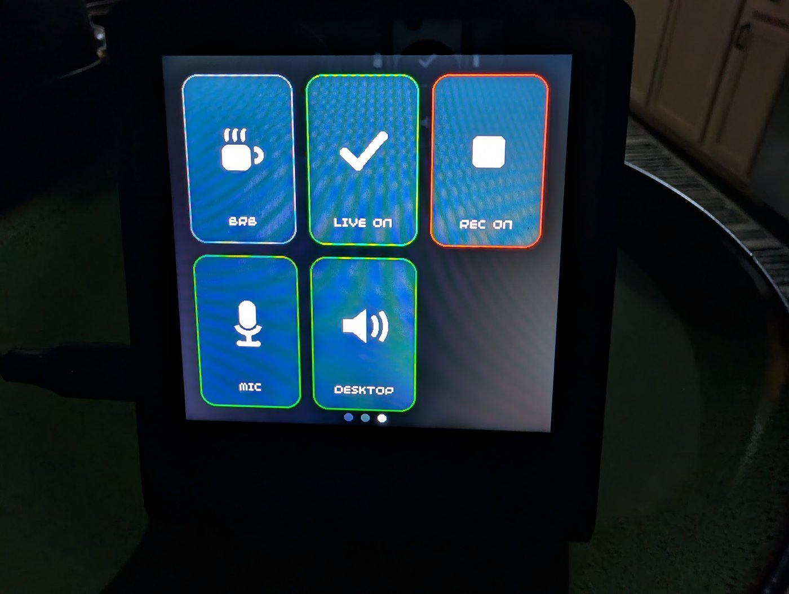
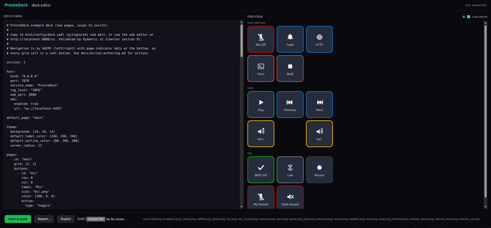
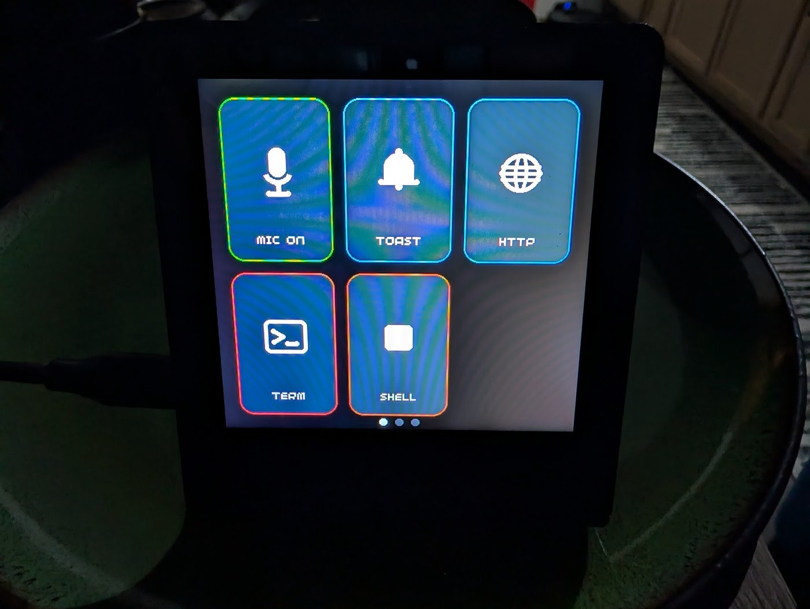
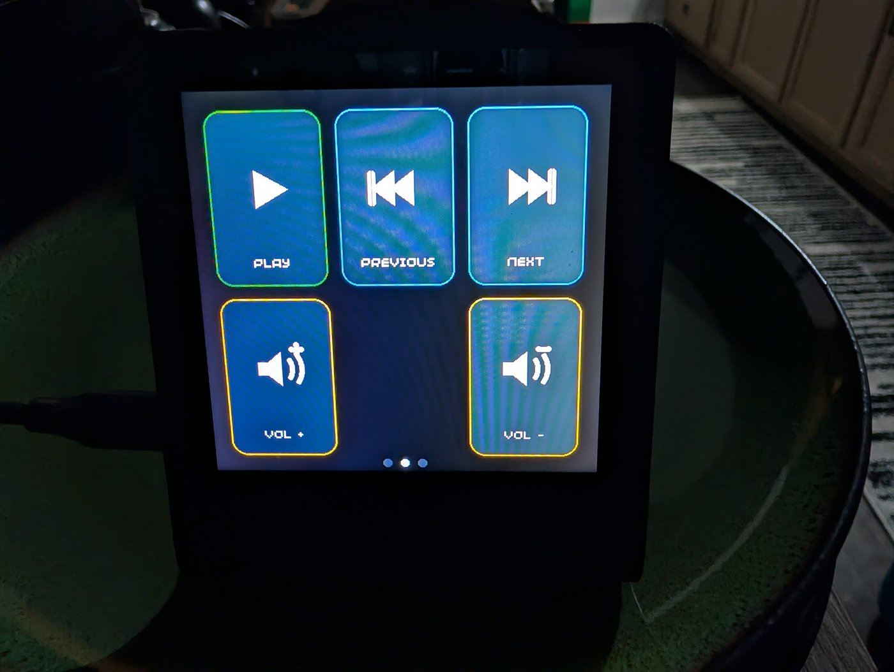
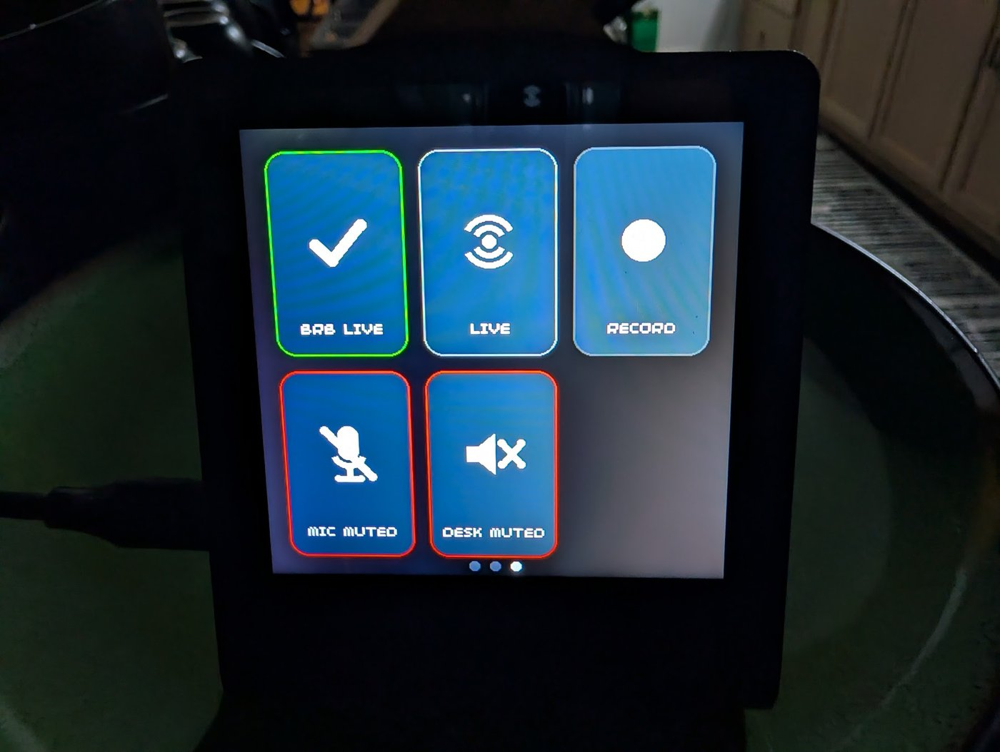
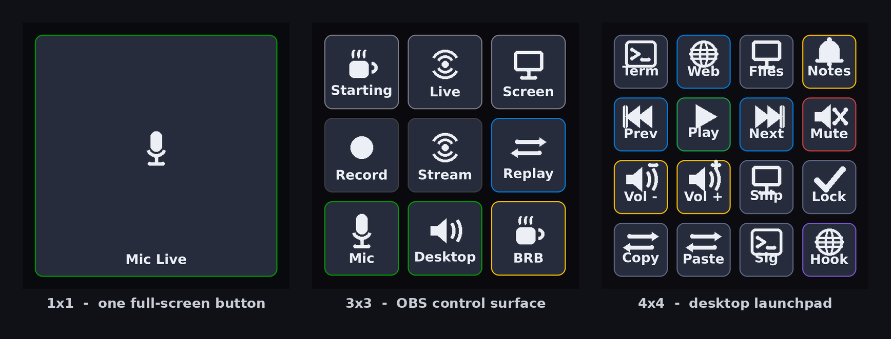
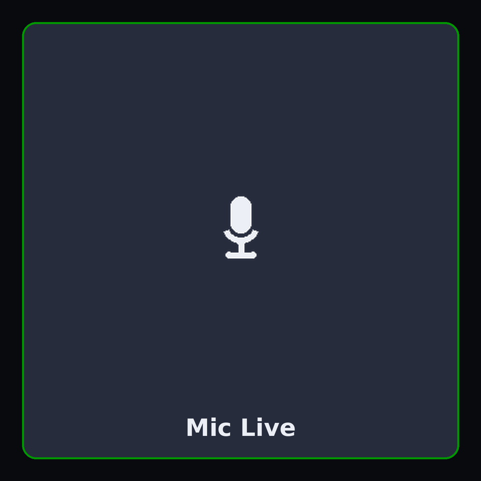
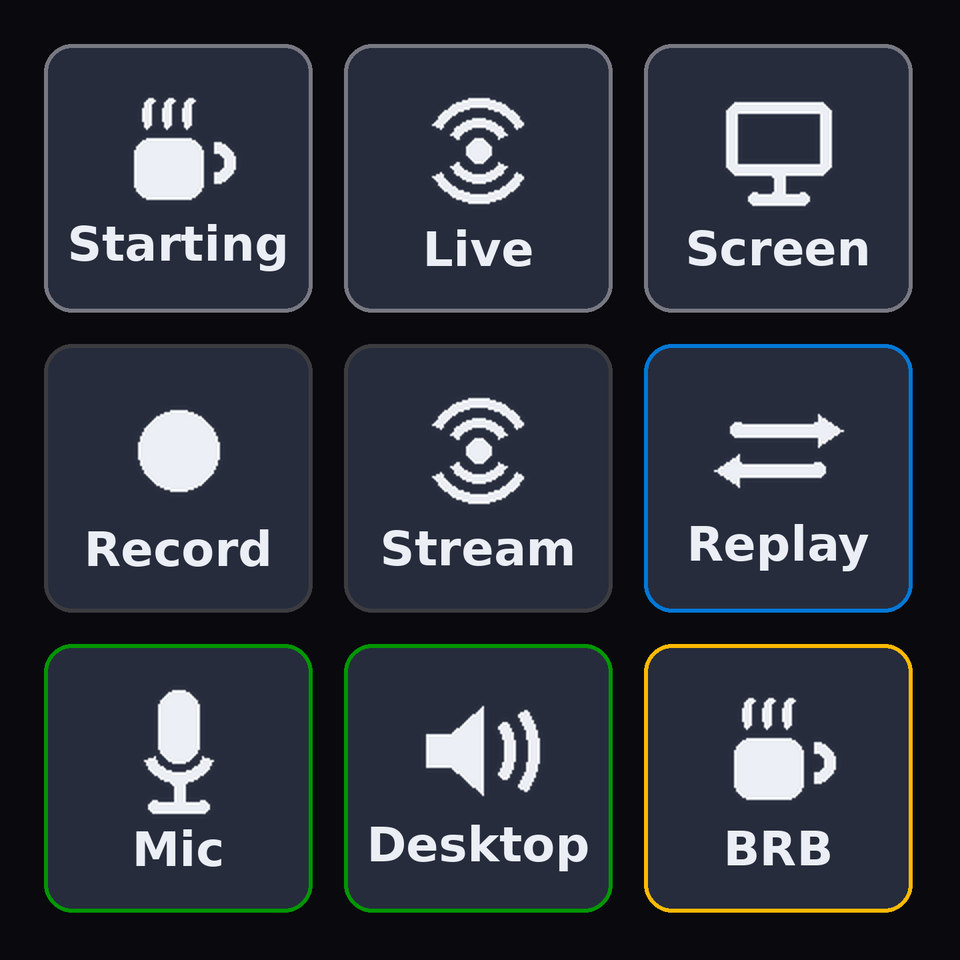
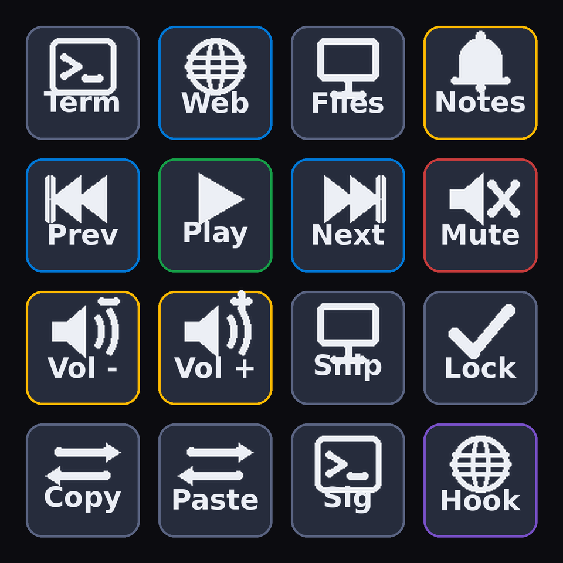
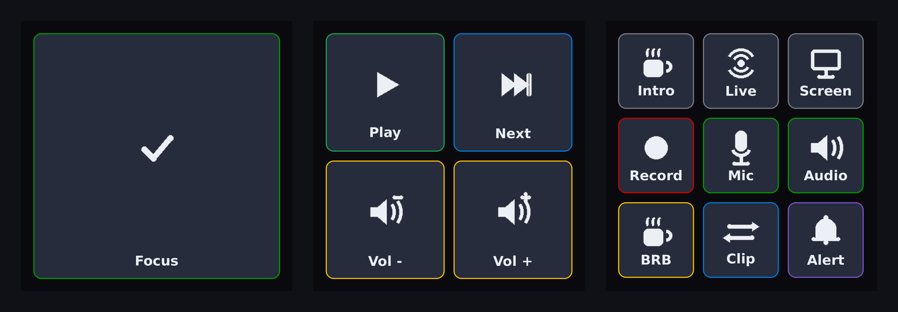

# PrestoDeck

<p align="center">
  
  <br>
  <em>PrestoDeck on real hardware - an OBS control page whose buttons reflect live streaming, recording, and mute state.</em>
</p>

A self-hosted, network-coupled Stream Deck replacement. A
[Pimoroni Presto](https://shop.pimoroni.com/products/presto) (RP2350B, 480x480
capacitive touchscreen, WiFi) renders configurable touch buttons and pages. A
long-lived host daemon on your desktop runs the configured action when you press
a button - launch an app, send a keystroke, hit a webhook, or control OBS Studio
(switch scenes, start/stop recording, mute your mic - with buttons that reflect
live OBS state), and so on.

Your layout lives on the host as a single human-editable YAML file (or you edit
it in the browser), and is pushed to the device live. Multi-page layouts (swipe
between them), per-button colour and icons, RGB LED feedback, and a Python
plugin system for custom actions are all supported.

## Wireless and untethered

The Presto talks to the host entirely over WiFi - there is no cable between the
two. Once it has your WiFi credentials (a one-time USB setup) the device needs
only power, so you can put it anywhere on your network: on the far side of the
desk, in another room, or across the house. It finds the host automatically over
mDNS, reconnects on its own if WiFi drops or the host restarts, and queues any
presses made while disconnected to replay once it is back. Run it from a USB
charger, a battery pack, or a wall socket - wherever is convenient within WiFi
range of the machine running the host.

## Quickstart

On a fresh machine, three commands:

```bash
make install   # install the host software on this computer
make setup      # plug the Presto in by USB; this puts your WiFi creds +
                # firmware on it, guided step by step
make run        # start the host; power-cycle the Presto and it appears
```

`make setup` asks for your **2.4 GHz** WiFi name and password (the Presto does
not do 5 GHz), writes them to the board, installs the firmware, and resets it.
`make run` starts the host: the Presto joins WiFi, finds the host automatically
over mDNS, and within ~10 seconds renders your deck. Press a button and the host
runs its action.

Prefer the underlying commands? They are `pip install -e ".[dev]"` (from
`host/`), then `prestodeck-setup`, then `prestodeck-host`. The host runs from any
directory and, on first run, drops an editable starter deck at
`~/.config/prestodeck/deck.yaml`.

## Configuring the deck

<p align="center">
  
  <br>
  <em>The web editor - deck YAML on the left, a live preview on the right.</em>
</p>

Edit your deck file (printed at host startup, e.g.
`~/.config/prestodeck/deck.yaml`) in any text editor, or open the web editor at
`http://localhost:8080/ui`. Changes are validated and pushed to the device live
- no restart. Pages hold a grid of buttons, each with a label, colour, optional
icon, and an action; **swipe left/right** on the device to move between pages.

The web editor's preview is also a **live virtual deck**: flip on *Live control*
and it connects to the host like the real hardware, so buttons mirror live state
(recording, mute, active scene) and clicking them runs the real action - handy
for building and testing a deck with no device plugged in. **Import** and
**Export** let you load a shared deck (or one of the examples below) or download
the current one to back up or share; an imported deck is validated in the editor
and only written when you *Save & push*.

<p align="center">
  <video src="assets/promo/live-demo.mp4" width="420" autoplay loop muted playsinline controls></video>
  <br>
  <em><a href="assets/promo/live-demo.mp4">Live control</a> - buttons react to real OBS state as you press them.</em>
</p>

- [docs/deck-config.md](docs/deck-config.md) - a guided, section-by-section
  configuration walkthrough,
- [docs/config-schema.md](docs/config-schema.md) - the full deck schema,
- [docs/action-authoring.md](docs/action-authoring.md) - the action catalog and
  how to write plugin actions,
- [docs/protocol.md](docs/protocol.md) - the device/host wire protocol.

## Screenshots

Real hardware - a Pimoroni Presto running PrestoDeck. Swipe left/right to move
between pages; the dots at the bottom show which page you are on.

<table>
  <tr>
    <td align="center" width="50%">
      <br>
      <b>Page 1</b> - mic toggle, notify toast, webhook, terminal, shell
    </td>
    <td align="center" width="50%">
      <br>
      <b>Page 2</b> - media transport and volume
    </td>
  </tr>
</table>

Buttons reflect live state. Here is the OBS page in two states - streaming and
recording, then with the mic and desktop audio muted - the deck updates itself
as OBS changes:

<table>
  <tr>
    <td align="center" width="50%">
      <br>
      <b>Live</b> - streaming and recording, mic and desktop active
    </td>
    <td align="center" width="50%">
      <br>
      <b>Muted</b> - mic and desktop muted, not live, not recording
    </td>
  </tr>
</table>

Prefer motion? <a href="assets/promo/demo.mp4">Watch the demo</a> - pages, live
OBS feedback, and the browser editor.

## Example decks

Pages can be any size - from a single full-screen button to a packed 4x4 grid.

<p align="center">
  
</p>

Ready-to-run configs live in [`examples/`](examples/) - run one with
`prestodeck-host --config examples/streaming-3x3.yaml`:

<table>
  <tr>
    <td align="center" width="25%">
      <br>
      <a href="examples/single-button.yaml"><b>single-button</b></a> - 1x1<br>
      full-screen push-to-mute
    </td>
    <td align="center" width="25%">
      <br>
      <a href="examples/streaming-3x3.yaml"><b>streaming-3x3</b></a> - 3x3<br>
      OBS control surface
    </td>
    <td align="center" width="25%">
      <br>
      <a href="examples/launchpad-4x4.yaml"><b>launchpad-4x4</b></a> - 4x4<br>
      desktop shortcut pad
    </td>
    <td align="center" width="25%">
      <br>
      <a href="examples/mixed-sizes.yaml"><b>mixed-sizes</b></a> - 1x1 to 4x4<br>
      one deck, every grid
    </td>
  </tr>
</table>

## Architecture at a glance

```
+-------------------------+            WiFi (2.4 GHz)            +---------------------------+
|   Pimoroni Presto        |   WebSocket over TCP, JSON frames   |   Host daemon (CPython)    |
|   MicroPython firmware    | <---------------------------------> |   prestodeck_host          |
|                           |                                     |                            |
|  - ezwifi bringup         |   device = WS client                |  - WS server (port 7878)   |
|  - mDNS scan              |   host   = WS server                |  - mDNS advertiser         |
|  - picographics render    |                                     |  - YAML config + Pydantic  |
|  - touch / swipe input    |   _prestodeck._tcp.local.           |  - action engine + plugins |
|  - icon cache (/icons)    |                                     |  - icon rasterizer         |
|  - 7x RGB LED + buzzer    |                                     |  - FastAPI web editor      |
+-------------------------+                                     +---------------------------+
```

- **Transport:** WebSocket over TCP. The host is the server; the device is the
  client.
- **Discovery:** mDNS / Zeroconf under `_prestodeck._tcp.local.` (zero-config).
- **Config:** one YAML file on the host, validated by Pydantic v2, resolved to
  JSON for the device.
- **Wire protocol:** JSON messages, one per WebSocket frame, shaped
  `{"type", "id", "payload"}` - see [docs/protocol.md](docs/protocol.md).

## Repository layout

```
device/   MicroPython firmware for the Presto (see device/README.md)
host/     CPython 3.11+ host daemon, action engine, and web UI (see host/README.md)
docs/     protocol, config schema, and action authoring references
examples/ ready-to-run example decks (1x1 up to 4x4)
tools/    deploy, icon-rendering, and preview/demo utilities
assets/   generated promo images and the demo clip
Makefile  friendly entry points: make install / setup / run / deploy / test
```

## Development

```bash
make check    # ruff + mypy (strict) + host & device test suites
make test     # just the tests
```

CI runs the same host checks plus a device byte-compile and the off-device
firmware tests on every push.

## License

MIT. See `LICENSE`.
